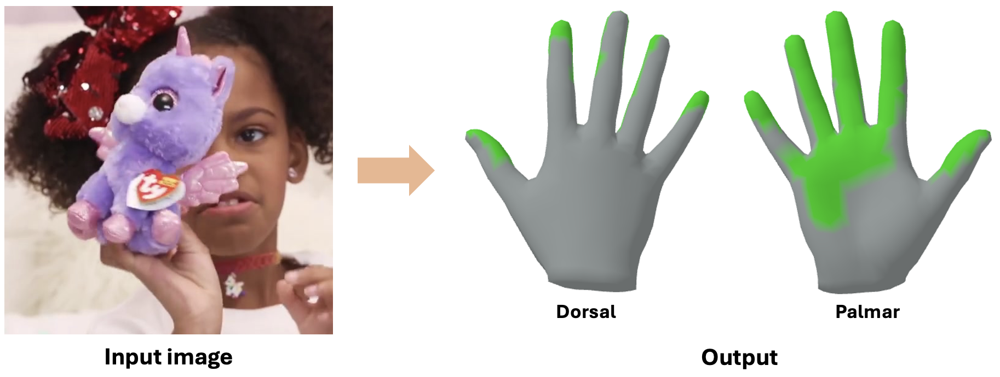

<div align="center">

# HACO: Learning Dense Hand Contact Estimation <br> from Imbalanced Data

<b>[Daniel Sungho Jung](https://dqj5182.github.io/)</b>, <b>[Kyoung Mu Lee](https://cv.snu.ac.kr/index.php/~kmlee/)</b> 

<p align="center">
    
</p>

<b>Seoul National University</b>

<a></a>
<a href="https://pytorch.org/get-started/locally/"></a>
[](https://creativecommons.org/licenses/by-nc/4.0/)
<a href='https://haco-release.github.io/'></a>
<a href="https://arxiv.org/pdf/2505.11152"></a>
<a href="https://arxiv.org/abs/2505.11152"></a>


<h2>ArXiv 2025</h2>



</div>

_**HACO** is a framework for **dense hand contact estimation** that addresses **class and spatial imbalance issues** in training on large-scale datasets. Based on **14 datasets** that span **hand-object**, **hand-hand**, **hand-scene**, and **hand-body interaction**, we build a powerful model that learns dense hand contact in diverse scenarios._


## Installation
* We recommend you to use an [Anaconda](https://www.anaconda.com/) virtual environment. Install PyTorch >=1.11.0 and Python >= 3.8.0. Our latest HACO model is tested on Python 3.8.20, PyTorch 1.11.0, CUDA 11.3.
* Setup the environment.
``` 
# Initialize conda environment
conda create -n haco python=3.8 -y
conda activate haco

# Install PyTorch
conda install pytorch==1.11.0 torchvision==0.12.0 torchaudio==0.11.0 cudatoolkit=11.3 -c pytorch

# Install all remaining packages
pip install -r requirements.txt
```
* Download our checkpoints from [OneDrive](https://1drv.ms/u/c/bf7e2a9a100f1dba/Ef18aU5ItbFDgW1sSv3P0l0BGTzN6PlsCnm0q5ecpTWIfQ?e=Y40qsN).


## Quick demo (Image)
To run HACO on demo images using the [Mediapipe](https://ai.google.dev/edge/mediapipe/solutions/guide) hand detector, please run:
```
python demo.py --backbone {BACKBONE_TYPE} --checkpoint {CKPT_PATH} --input_path {INPUT_PATH}
```

For example,
```
# ViT-H (Default, HaMeR initialized) backbone
python demo.py --backbone hamer --checkpoint release_checkpoint/haco_final_hamer_checkpoint.ckpt --input_path asset/example_images

# ViT-B (ImageNet initialized) backbone
python demo.py --backbone vit-b-16 --checkpoint release_checkpoint/haco_final_vit_b_checkpoint.ckpt --input_path asset/example_images
```

> Note: The demo includes post-processing to reduce noise in small or sparse contact areas.

## Quick demo (Video)
Before the demo, please download example videos from [OneDrive](https://1drv.ms/u/c/bf7e2a9a100f1dba/ERsk_D-EubxBi1Usu2bW2hABwy9nxzRxAHutXDxmv85TLw?e=rIjOI7) and save at `asset/example_videos`.<br>

To run HACO on demo videos using the [Mediapipe](https://ai.google.dev/edge/mediapipe/solutions/guide) hand detector, please run:
```
python demo_video.py --backbone {BACKBONE_TYPE} --checkpoint {CKPT_PATH} --input_path {INPUT_PATH}
```

For example,
```
# ViT-H (Default, HaMeR initialized) backbone
python demo_video.py --backbone hamer --checkpoint release_checkpoint/haco_final_hamer_checkpoint.ckpt --input_path asset/example_videos

# ViT-B (ImageNet initialized) backbone
python demo_video.py --backbone vit-b-16 --checkpoint release_checkpoint/haco_final_vit_b_checkpoint.ckpt --input_path asset/example_videos
```

> Note: The demo includes post-processing for both spatial smoothing of small contact areas and temporal smoothing across frames to ensure stable contact predictions and hand detections.


## Data
You need to follow directory structure of the `data` and `release_checkpoint` as below.
```
${ROOT} 
|-- data  
|   |-- base_data
|   |   |-- demo_data
|   |   |   |-- hand_landmarker.task
|   |   |-- human_models
|   |   |   |-- mano
|   |   |   |   |-- MANO_LEFT.pkl
|   |   |   |   |-- MANO_RIGHT.pkl
|   |   |   |   |-- V_regressor_84.npy
|   |   |   |   |-- V_regressor_336.npy
|   |   |-- pretrained_models
|   |   |   |-- hamer
|   |   |   |-- handoccnet
|   |   |   |-- hrnet
|   |   |   |-- pose2pose
|   |-- MOW
|   |   |-- data
|   |   |   |-- images
|   |   |   |-- masks
|   |   |   |-- models
|   |   |   |-- poses.json
|   |   |   |-- watertight_models
|   |   |-- preprocessed_data
|   |   |   |-- test
|   |   |   |   |-- contact_data
|   |   |-- splits
|   |   |-- dataset.py
|-- release_checkpoint
```
* Download base_data from [OneDrive](https://1drv.ms/u/c/bf7e2a9a100f1dba/EUmlgxCPqwpEvIhma80VZsoBnHrIPXzbsmJzoQpP-saj-A?e=fSxPEi).
* Download [MOW](https://zhec.github.io/rhoi/) data from GitHub ([images](https://github.com/ZheC/MOW), [models](https://github.com/ZheC/MOW), [poses.json](https://github.com/ZheC/MOW)) and OneDrive ([masks](https://1drv.ms/u/c/bf7e2a9a100f1dba/Ef2YhwccS4tPt1WrAAP4-iMBjcaSUgawDMnf_HDpqoTeNw?e=eQYJ4e), [watertight_models](https://1drv.ms/u/c/bf7e2a9a100f1dba/EW5YXeXtk3NBnX9PcvJtGIABj_9c1FW2RdrcppDgRzqHhg?e=ryUqCf), [preprocessed_data](https://1drv.ms/u/c/bf7e2a9a100f1dba/ESkqLhHk9gFHo4HH2uA9akABgYuS2wLgWfr4YJMRmagezQ?e=DoGFso), [splits](https://1drv.ms/u/c/bf7e2a9a100f1dba/EW60jCPiuNNOjkmCUdqlBbEBact_Ums22dwBoQoFMkUV6w?e=2lxpJd)). For GitHub data, you can directly download them by running:
```
bash scripts/download_official_mow.sh
```
* Download initial checkpoints by running:
```
bash scripts/download_initial_checkpoints.sh
```

## Running HACO
### Train 
TBA by the June, 2025.

### Test
To evaluate HACO on [MOW](https://github.com/ZheC/MOW) dataset, please run:
```
python test.py --backbone {BACKBONE_TYPE} --checkpoint {CKPT_PATH}
```

For example,
```
# ViT-H (Default, HaMeR initialized) backbone
python test.py --backbone hamer --checkpoint release_checkpoint/haco_final_hamer_checkpoint.ckpt

# ViT-L (ImageNet initialized) backbone
python test.py --backbone vit-l-16 --checkpoint release_checkpoint/haco_final_vit_l_checkpoint.ckpt

# ViT-B (ImageNet initialized) backbone
python test.py --backbone vit-b-16 --checkpoint release_checkpoint/haco_final_vit_b_checkpoint.ckpt

# ViT-S (ImageNet initialized) backbone
python test.py --backbone vit-s-16 --checkpoint release_checkpoint/haco_final_vit_s_checkpoint.ckpt

# FPN (HandOccNet initialized) backbone
python test.py --backbone handoccnet --checkpoint release_checkpoint/haco_final_handoccnet_checkpoint.ckpt

# HRNet-W48 (ImageNet initialized) backbone
python test.py --backbone hrnet-w48 --checkpoint release_checkpoint/haco_final_hrnet_w48_checkpoint.ckpt

# HRNet-W32 (ImageNet initialized) backbone
python test.py --backbone hrnet-w32 --checkpoint release_checkpoint/haco_final_hrnet_w32_checkpoint.ckpt

# ResNet-152 (ImageNet initialized) backbone
python test.py --backbone resnet-152 --checkpoint release_checkpoint/haco_final_resnet_152_checkpoint.ckpt

# ResNet-101 (ImageNet initialized) backbone
python test.py --backbone resnet-101 --checkpoint release_checkpoint/haco_final_resnet_101_checkpoint.ckpt

# ResNet-50 (ImageNet initialized) backbone
python test.py --backbone resnet-50 --checkpoint release_checkpoint/haco_final_resnet_50_checkpoint.ckpt

# ResNet-34 (ImageNet initialized) backbone
python test.py --backbone resnet-34 --checkpoint release_checkpoint/haco_final_resnet_34_checkpoint.ckpt

# ResNet-18 (ImageNet initialized) backbone
python test.py --backbone resnet-18 --checkpoint release_checkpoint/haco_final_resnet_18_checkpoint.ckpt
```


## Technical Q&A
* ImportError: cannot import name 'bool' from 'numpy': Please just comment out the line "from numpy import bool, int, float, complex, object, unicode, str, nan, inf".
* `np.int` was a deprecated alias for the builtin `int`. To avoid this error in existing code, use `int` by itself. Doing this will not modify any behavior and is safe. When replacing `np.int`, you may wish to use e.g. `np.int64` or `np.int32` to specify the precision. If you wish to review your current use, check the release note link for additional information: Please refer to [here](https://github.com/scikit-optimize/scikit-optimize/issues/1171)


## Acknowledgement
We thank:
* [DECO](https://openaccess.thecvf.com/content/ICCV2023/papers/Tripathi_DECO_Dense_Estimation_of_3D_Human-Scene_Contact_In_The_Wild_ICCV_2023_paper.pdf) for human-scene contact estimation.
* [CB Loss](https://openaccess.thecvf.com/content_CVPR_2019/papers/Cui_Class-Balanced_Loss_Based_on_Effective_Number_of_Samples_CVPR_2019_paper.pdf) for inspiration on VCB Loss.
* [HaMeR](https://openaccess.thecvf.com/content/CVPR2024/papers/Pavlakos_Reconstructing_Hands_in_3D_with_Transformers_CVPR_2024_paper.pdf) for Transformer-based regression architecture.


## Reference
```  
@article{jung2025haco,    
title = {Learning Dense Hand Contact Estimation from Imbalanced Data},
author = {Jung, Daniel Sungho and Lee, Kyoung Mu},
journal = {arXiv preprint arXiv:2505.11152},  
year = {2025}  
}  
```
